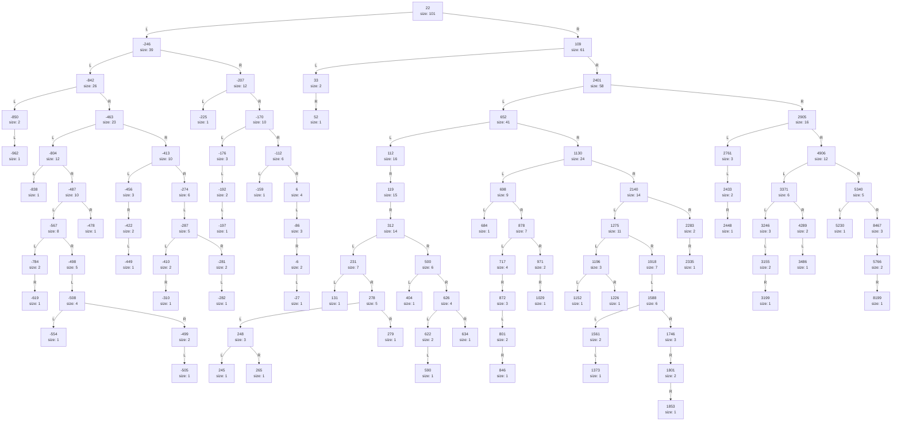

# Дерево после rebalance

```mermaid
graph TD
  node1["22<br/>size: 101"]
  node2["-246<br/>size: 39"]
  node1 -->|L| node2
  node3["-842<br/>size: 26"]
  node2 -->|L| node3
  node4["-850<br/>size: 2"]
  node3 -->|L| node4
  node5["-962<br/>size: 1"]
  node4 -->|L| node5
  node6["-463<br/>size: 23"]
  node3 -->|R| node6
  node7["-804<br/>size: 12"]
  node6 -->|L| node7
  node8["-838<br/>size: 1"]
  node7 -->|L| node8
  node9["-487<br/>size: 10"]
  node7 -->|R| node9
  node10["-567<br/>size: 8"]
  node9 -->|L| node10
  node11["-784<br/>size: 2"]
  node10 -->|L| node11
  node12["-619<br/>size: 1"]
  node11 -->|R| node12
  node13["-498<br/>size: 5"]
  node10 -->|R| node13
  node14["-508<br/>size: 4"]
  node13 -->|L| node14
  node15["-554<br/>size: 1"]
  node14 -->|L| node15
  node16["-499<br/>size: 2"]
  node14 -->|R| node16
  node17["-505<br/>size: 1"]
  node16 -->|L| node17
  node18["-478<br/>size: 1"]
  node9 -->|R| node18
  node19["-413<br/>size: 10"]
  node6 -->|R| node19
  node20["-456<br/>size: 3"]
  node19 -->|L| node20
  node21["-422<br/>size: 2"]
  node20 -->|R| node21
  node22["-449<br/>size: 1"]
  node21 -->|L| node22
  node23["-274<br/>size: 6"]
  node19 -->|R| node23
  node24["-287<br/>size: 5"]
  node23 -->|L| node24
  node25["-410<br/>size: 2"]
  node24 -->|L| node25
  node26["-310<br/>size: 1"]
  node25 -->|R| node26
  node27["-281<br/>size: 2"]
  node24 -->|R| node27
  node28["-282<br/>size: 1"]
  node27 -->|L| node28
  node29["-207<br/>size: 12"]
  node2 -->|R| node29
  node30["-225<br/>size: 1"]
  node29 -->|L| node30
  node31["-170<br/>size: 10"]
  node29 -->|R| node31
  node32["-176<br/>size: 3"]
  node31 -->|L| node32
  node33["-192<br/>size: 2"]
  node32 -->|L| node33
  node34["-197<br/>size: 1"]
  node33 -->|L| node34
  node35["-112<br/>size: 6"]
  node31 -->|R| node35
  node36["-159<br/>size: 1"]
  node35 -->|L| node36
  node37["6<br/>size: 4"]
  node35 -->|R| node37
  node38["-86<br/>size: 3"]
  node37 -->|L| node38
  node39["-6<br/>size: 2"]
  node38 -->|R| node39
  node40["-27<br/>size: 1"]
  node39 -->|L| node40
  node41["109<br/>size: 61"]
  node1 -->|R| node41
  node42["33<br/>size: 2"]
  node41 -->|L| node42
  node43["52<br/>size: 1"]
  node42 -->|R| node43
  node44["2401<br/>size: 58"]
  node41 -->|R| node44
  node45["652<br/>size: 41"]
  node44 -->|L| node45
  node46["112<br/>size: 16"]
  node45 -->|L| node46
  node47["119<br/>size: 15"]
  node46 -->|R| node47
  node48["312<br/>size: 14"]
  node47 -->|R| node48
  node49["231<br/>size: 7"]
  node48 -->|L| node49
  node50["131<br/>size: 1"]
  node49 -->|L| node50
  node51["278<br/>size: 5"]
  node49 -->|R| node51
  node52["248<br/>size: 3"]
  node51 -->|L| node52
  node53["245<br/>size: 1"]
  node52 -->|L| node53
  node54["265<br/>size: 1"]
  node52 -->|R| node54
  node55["279<br/>size: 1"]
  node51 -->|R| node55
  node56["500<br/>size: 6"]
  node48 -->|R| node56
  node57["404<br/>size: 1"]
  node56 -->|L| node57
  node58["626<br/>size: 4"]
  node56 -->|R| node58
  node59["622<br/>size: 2"]
  node58 -->|L| node59
  node60["590<br/>size: 1"]
  node59 -->|L| node60
  node61["634<br/>size: 1"]
  node58 -->|R| node61
  node62["1130<br/>size: 24"]
  node45 -->|R| node62
  node63["698<br/>size: 9"]
  node62 -->|L| node63
  node64["684<br/>size: 1"]
  node63 -->|L| node64
  node65["878<br/>size: 7"]
  node63 -->|R| node65
  node66["717<br/>size: 4"]
  node65 -->|L| node66
  node67["872<br/>size: 3"]
  node66 -->|R| node67
  node68["801<br/>size: 2"]
  node67 -->|L| node68
  node69["846<br/>size: 1"]
  node68 -->|R| node69
  node70["971<br/>size: 2"]
  node65 -->|R| node70
  node71["1029<br/>size: 1"]
  node70 -->|R| node71
  node72["2140<br/>size: 14"]
  node62 -->|R| node72
  node73["1275<br/>size: 11"]
  node72 -->|L| node73
  node74["1196<br/>size: 3"]
  node73 -->|L| node74
  node75["1152<br/>size: 1"]
  node74 -->|L| node75
  node76["1226<br/>size: 1"]
  node74 -->|R| node76
  node77["1918<br/>size: 7"]
  node73 -->|R| node77
  node78["1588<br/>size: 6"]
  node77 -->|L| node78
  node79["1561<br/>size: 2"]
  node78 -->|L| node79
  node80["1373<br/>size: 1"]
  node79 -->|L| node80
  node81["1746<br/>size: 3"]
  node78 -->|R| node81
  node82["1801<br/>size: 2"]
  node81 -->|R| node82
  node83["1853<br/>size: 1"]
  node82 -->|R| node83
  node84["2283<br/>size: 2"]
  node72 -->|R| node84
  node85["2335<br/>size: 1"]
  node84 -->|R| node85
  node86["2905<br/>size: 16"]
  node44 -->|R| node86
  node87["2761<br/>size: 3"]
  node86 -->|L| node87
  node88["2433<br/>size: 2"]
  node87 -->|L| node88
  node89["2448<br/>size: 1"]
  node88 -->|R| node89
  node90["4906<br/>size: 12"]
  node86 -->|R| node90
  node91["3371<br/>size: 6"]
  node90 -->|L| node91
  node92["3246<br/>size: 3"]
  node91 -->|L| node92
  node93["3155<br/>size: 2"]
  node92 -->|L| node93
  node94["3199<br/>size: 1"]
  node93 -->|R| node94
  node95["4289<br/>size: 2"]
  node91 -->|R| node95
  node96["3486<br/>size: 1"]
  node95 -->|L| node96
  node97["5340<br/>size: 5"]
  node90 -->|R| node97
  node98["5230<br/>size: 1"]
  node97 -->|L| node98
  node99["8467<br/>size: 3"]
  node97 -->|R| node99
  node100["5766<br/>size: 2"]
  node99 -->|L| node100
  node101["8199<br/>size: 1"]
  node100 -->|R| node101
```

